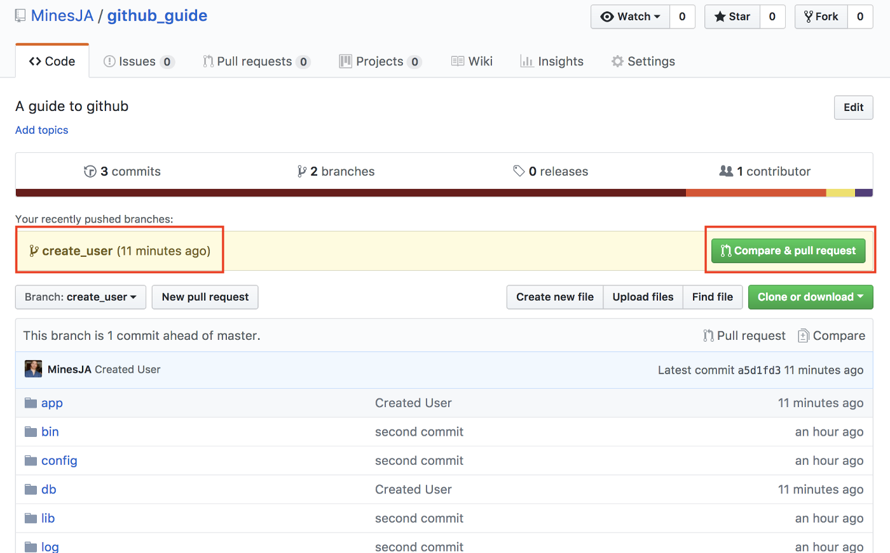
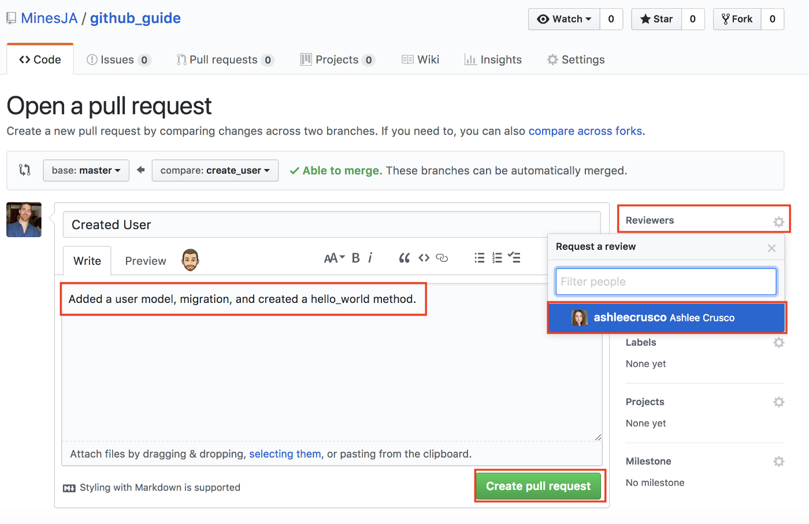

## Quiz Project built with Angular Front-End and Laravel Rest Api.

# Cloning and Setting Up Your Project

Go through following steps:

1) Run `git clone [URL of current repository]` on your `ip-group-project` folder (or anywhere preferred).
2) Go to this project's `back-end` folder on your terminal, and run `composer install`
3) Rename `.env.example` file in this folder to `.env`. You can do it directly from your terminal:
	- For Windows, run `ren .env.example .env`
	- For Linux/Mac, run `mv .env.example .env`
4) After that, generate a new app key, run `php artisan key:generate`
5) Go to a PHPMyAdmin page on your local computer and create a database `quizdb`.
6) Open `.env` file and set up your database connection settings. Modify below variables according to the settings of your environment.
```
DB_CONNECTION=mysql
DB_HOST=127.0.0.1 
DB_PORT=3306
DB_DATABASE=quizdb
DB_USERNAME=root
DB_PASSWORD=
```
7) Run `php artisan migrate --seed`
8) Finally, run `php artisan serve`
9) Go to this project's `front-end` folder on your terminal, and run `npm install`. 
   This will download all dependencies inside `node_modulus` folder.
10) Finally, run `npm start` to start Angular Project.   

Note, that in order set up this project on your PC, you must have latest versions of PHP and Composer (http://getcomposer.org/) installed on your computer and they must be accessible from your terminal. You have to add paths to these tools into your PATH environment variable to make them accessible from your terminal.

## !!! Important Notice !!!
Before doing any changes to the poject, make sure that you are in different feature branch from master.
To do so, open your terminal inside this project's folder, and run `git checkout -b feature/branch_name`

## Submiting Your Contribution

Once you finish your contribution, go through following steps:

1) Open terminal in your project's root directory.
2) Run `git add .`
3) Run `git commit -m 'briefly summarize what you have done (It is up to you what to write)'`
4) Run `git push`
5) Now go to the Github Repo page. You should see the branch you pushed up in a yellow bar at the top of the page with a button to “Compare & pull request”.

6) Click “Compare & pull request”. This will take you to the “Open a pull request” page. From here, you should write a brief description of what you actually changed. And you should click the “Reviewers” tab and select whoever your team decided would be the “Merge Master”. When you’re done, click “Create pull request”.



